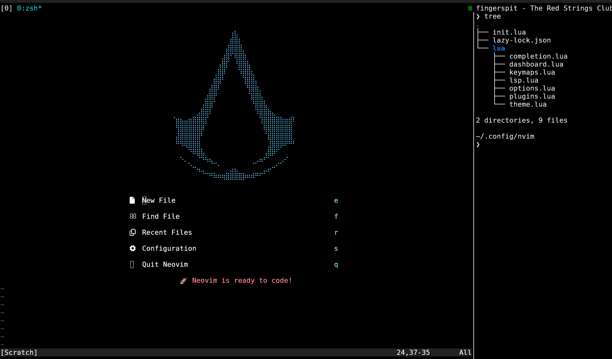
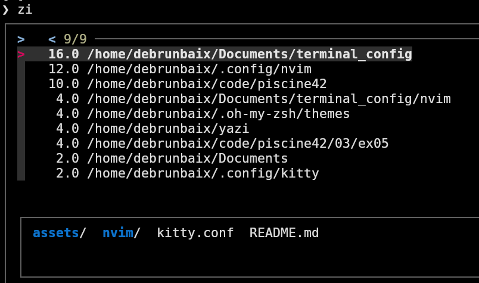
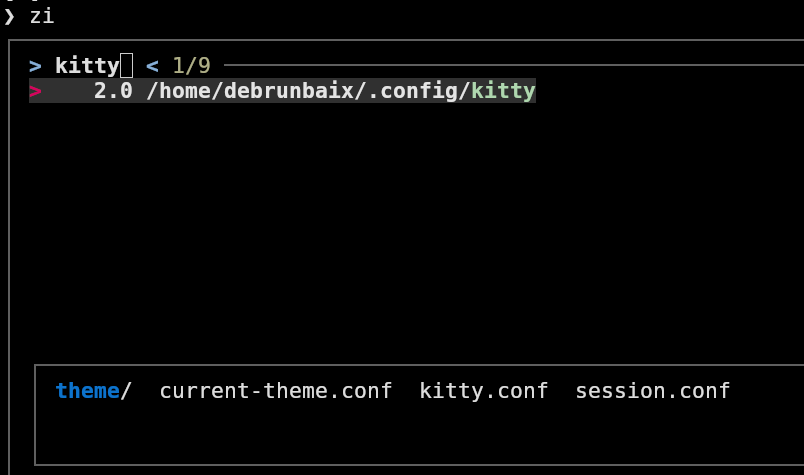
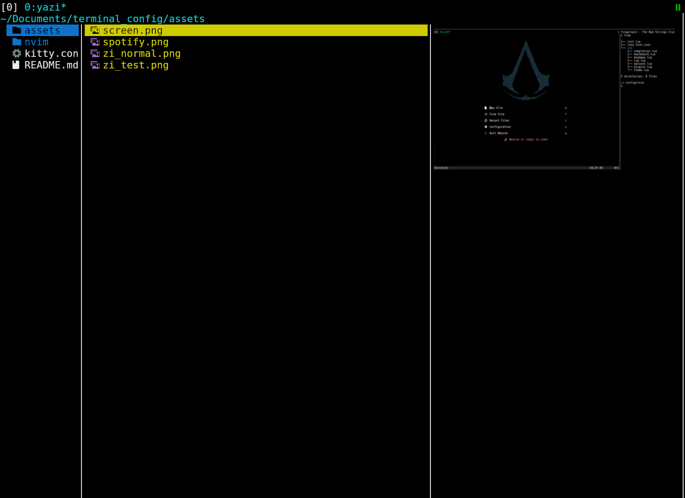

# Kitty + Zsh Configuration

This repository contains my custom configuration files for various tools, including Kitty, Zsh, Tmux, and more. Each file is designed to optimize my workflow with efficient keybindings, custom themes, and useful aliases.

## Terminal Emulator | Kitty

> kitty.conf

Kitty is my preferred terminal emulator. This configuration includes:

Font settings:

- font_family Monospace

- font_size 16.0

Disabling the audio bell:

- enable_audio_bell no

## Shell | ZShell

> .zshrc

Zsh is my shell of choice, configured with Oh My Zsh.

Theme: 

- Custom theme debrunbaix

Plugins:

- git - Git command aliases and enhancements

- urltools - Useful URL manipulation tools

- web-search - Search queries from the command line

Aliases:

- e → exit

- ipa → ip -br -c a (Show IP addresses in a clean and simple format)

- install → sudo apt install

- r2 → radare2 (My favorite disassembler)

- bat → batcat (Alternative to cat with syntax highlighting)

- v → nvim (Open Neovim quickly)

- ya → yazi (Terminal file manager)

## IDE | Nvim

| Shortcut     | Action                          |
|-------------|--------------------------------|
| `<Leader>f` | Open Telescope (Find files)    |
| `<Leader>o` | Open Oil.nvim (File Explorer)  |

> **Note:** `<Leader>` is set to **Space** (`<Space>`).

## Other cool tools

### Zoxide

**Zoxide** is a blazing fast alternative to `cd`, designed to help you navigate your directories efficiently.  
Instead of manually typing long paths, **Zoxide** learns your most used directories and allows you to jump to them quickly.

**Advantages**:
- **Smarter navigation**: Learns your frequent directories and ranks them.
- **Fuzzy matching**: You don’t need to type the full path, just a part of it.
- **Speed**: Much faster than traditional `cd` commands.

**Usage**:
- `z project` → Jump to the most visited "project" directory.
- `zi config` → Search and navigate to a directory containing "config".

### Yazi

**Yazi** is a modern, high-performance terminal file manager designed for efficiency and speed. It offers a **keyboard-driven workflow**, **rich previews**, and **extensive customization**.

**Advantages**:
- **Minimal & Fast**: Built for speed with a responsive UI.
- **Vim-like Navigation**: Uses familiar keybindings (`h/j/k/l` for navigation).
- **Rich Previews**: Supports images, videos, PDFs, and more.

**Usage**:
- `ya` → Launch Yazi.
- `h/l` → Navigate between directories.
- `j/k` → Move up/down in the file list.
- `Enter` → Open file/directory.
