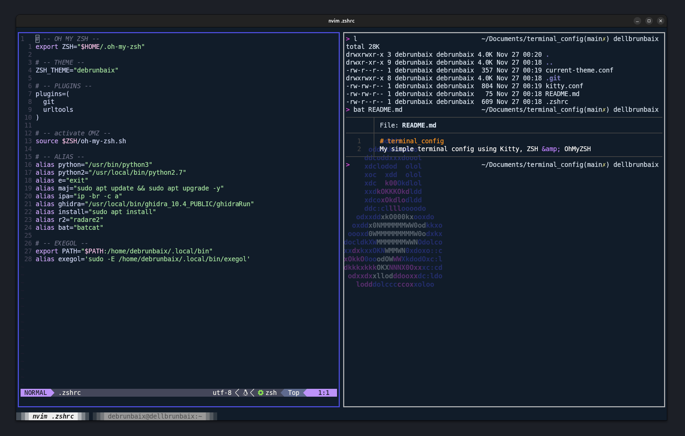

# Kitty + Zsh Configuration

This repository contains my custom configuration for the [Kitty](https://sw.kovidgoyal.net/kitty/) terminal and [Zsh](https://www.zsh.org/) shell with [Oh My Zsh](https://ohmyz.sh/).

## 🖼️ Preview

## 📄 Included Files
- `kitty.conf`: Kitty configuration file
- `.zshrc`: Zsh configuration with aliases and plugins
- `assets/exemple.png`: Screenshot of the setup

## 🔧 Installation
1. Copy `kitty.conf` to `~/.config/kitty/`.
2. Replace or merge your `.zshrc` with the provided file.

Enjoy this minimalist and efficient setup!
